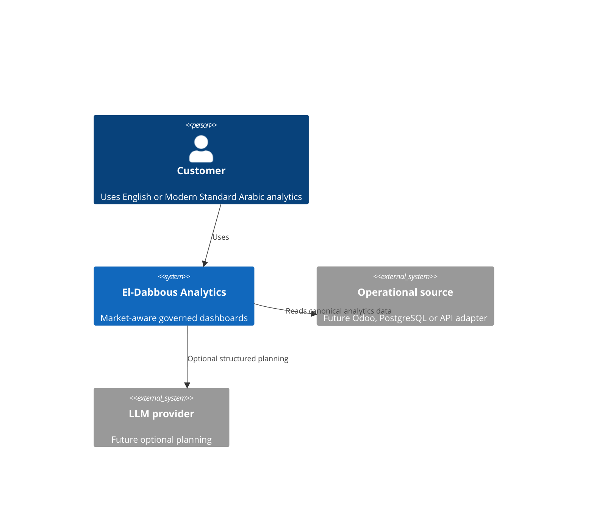
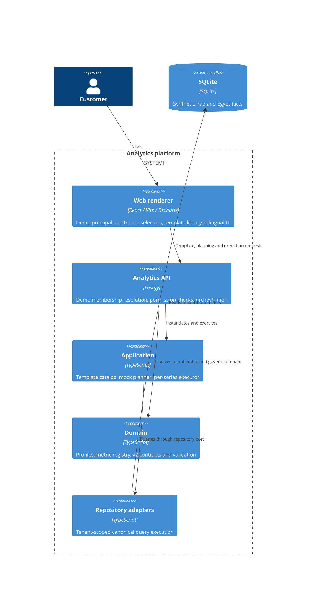
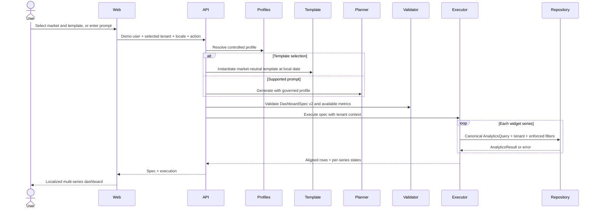
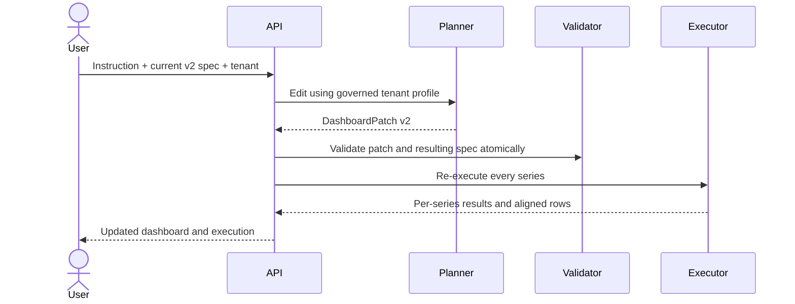
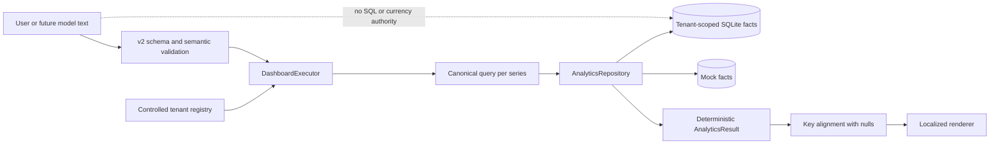
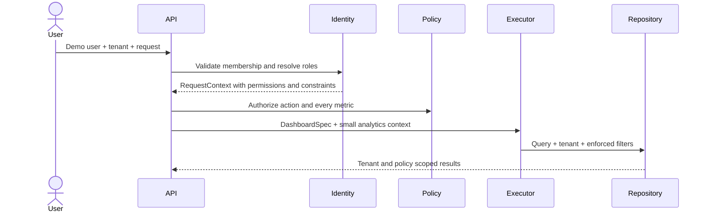

# Architecture diagrams

## C4 system context

```mermaid
C4Context
  Person(customer, "Customer", "Uses English or Modern Standard Arabic analytics")
  System(platform, "El-Dabbous Analytics", "Market-aware governed dashboards")
  System_Ext(source, "Operational source", "Future Odoo, PostgreSQL or API adapter")
  System_Ext(model, "LLM provider", "Future optional planning")
  Rel(customer, platform, "Uses")
  Rel(platform, source, "Reads canonical analytics data")
  Rel(platform, model, "Optional structured planning")
```

## C4 container

```mermaid
C4Container
  Person(customer, "Customer")
  System_Boundary(platform, "Analytics platform") {
    Container(ui, "Web renderer", "React / Vite / Recharts", "Demo principal and tenant selectors, template library, bilingual UI")
    Container(api, "Analytics API", "Fastify", "Demo membership resolution, permission checks, orchestration")
    Container(application, "Application", "TypeScript", "Template catalog, mock planner, per-series executor")
    Container(domain, "Domain", "TypeScript", "Profiles, metric registry, v2 contracts and validation")
    Container(data, "Repository adapters", "TypeScript", "Tenant-scoped canonical query execution")
  }
  ContainerDb(sqlite, "SQLite", "SQLite", "Synthetic Iraq and Egypt facts")
  Rel(customer, ui, "Uses")
  Rel(ui, api, "Template, planning and execution requests")
  Rel(api, domain, "Resolves membership and governed tenant")
  Rel(api, application, "Instantiates and executes")
  Rel(application, data, "Queries through repository port")
  Rel(data, sqlite, "Reads tenant-bound facts")
```

## Template and generation sequence

```mermaid
sequenceDiagram
  actor User
  participant Web
  participant API
  participant Profiles
  participant Template
  participant Planner
  participant Validator
  participant Executor
  participant Repository
  User->>Web: Select market and template, or enter prompt
  Web->>API: Demo user + selected tenant + locale + action
  API->>Profiles: Resolve controlled profile
  alt Template selection
    API->>Template: Instantiate market-neutral template at local date
  else Supported prompt
    API->>Planner: Generate with governed profile
  end
  API->>Validator: Validate DashboardSpec v2 and available metrics
  API->>Executor: Execute spec with tenant context
  loop Each widget series
    Executor->>Repository: Canonical AnalyticsQuery + tenant + enforced filters
    Repository-->>Executor: AnalyticsResult or error
  end
  Executor-->>API: Aligned rows + per-series states
  API-->>Web: Spec + execution
  Web-->>User: Localized multi-series dashboard
```

## Editing sequence

```mermaid
sequenceDiagram
  actor User
  participant API
  participant Planner
  participant Validator
  participant Executor
  User->>API: Instruction + current v2 spec + tenant
  API->>Planner: Edit using governed tenant profile
  Planner-->>API: DashboardPatch v2
  API->>Validator: Validate patch and resulting spec atomically
  API->>Executor: Re-execute every series
  Executor-->>API: Per-series results and aligned rows
  API-->>User: Updated dashboard and execution
```

## Analytics data flow and trust boundary

```mermaid
flowchart LR
  U[User or future model text] --> V[v2 schema and semantic validation]
  T[Controlled tenant registry] --> Q[DashboardExecutor]
  V --> Q
  Q --> S[Canonical query per series]
  S --> R[AnalyticsRepository]
  R --> D[(Tenant-scoped SQLite facts)]
  R --> M[(Mock facts)]
  R --> A[Deterministic AnalyticsResult]
  A --> K[Key alignment with nulls]
  K --> W[Localized renderer]
  U -. no SQL or currency authority .-> D
```

## Authorization boundary

```mermaid
sequenceDiagram
  actor User
  participant API
  participant Identity
  participant Policy
  participant Executor
  participant Repository
  User->>API: Demo user + tenant + request
  API->>Identity: Validate membership and resolve roles
  Identity-->>API: RequestContext with permissions and constraints
  API->>Policy: Authorize action and every metric
  API->>Executor: DashboardSpec + small analytics context
  Executor->>Repository: Query + tenant + enforced filters
  Repository-->>API: Tenant and policy scoped results
```
