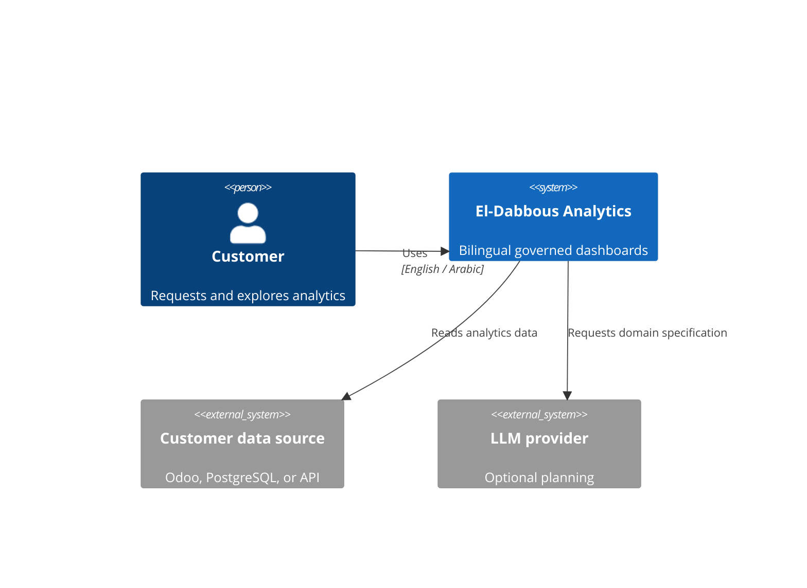
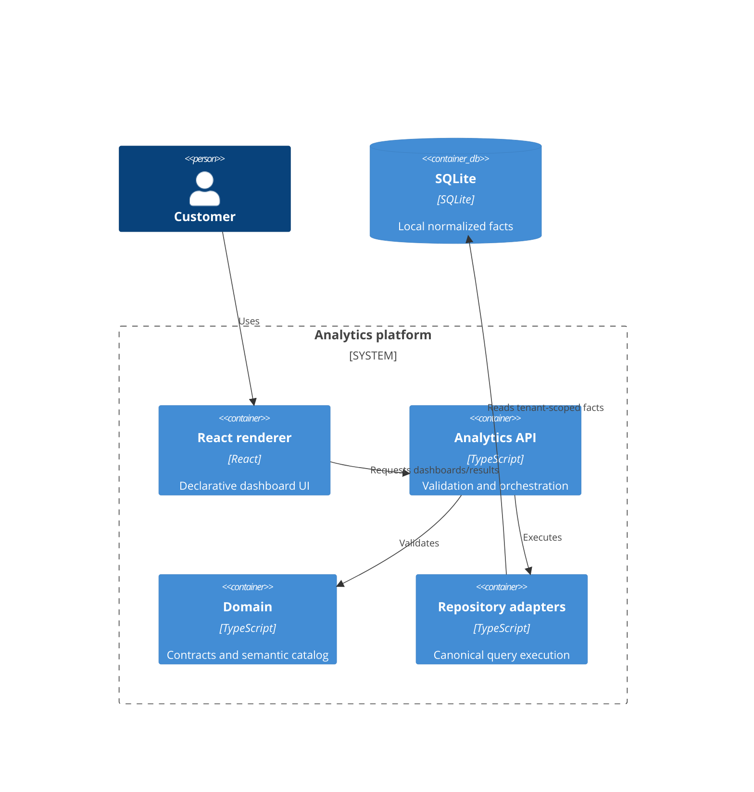
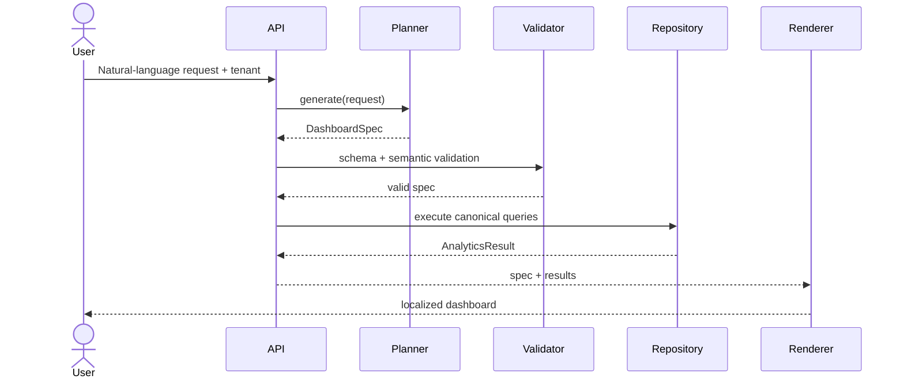
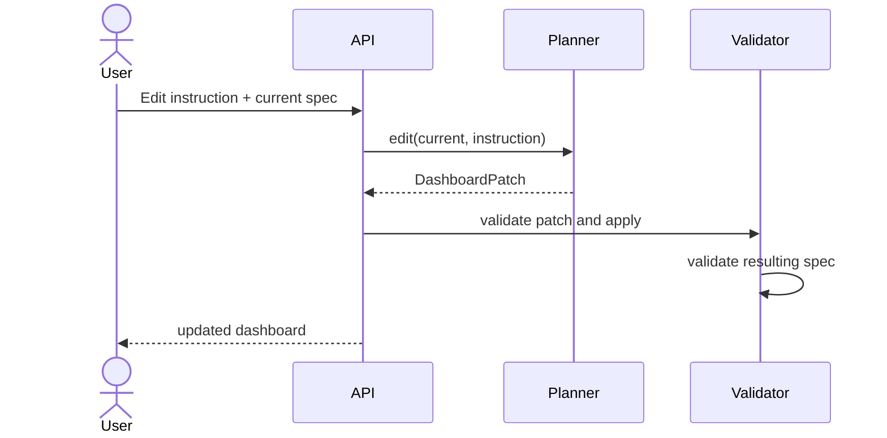
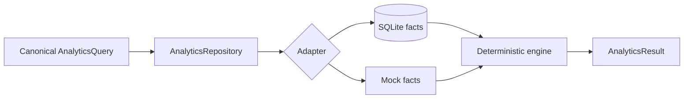
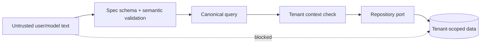

# Architecture diagrams

## C4 system context

```mermaid
C4Context
  Person(customer, "Customer", "Requests and explores analytics")
  System(platform, "El-Dabbous Analytics", "Bilingual governed dashboards")
  System_Ext(source, "Customer data source", "Odoo, PostgreSQL, or API")
  System_Ext(model, "LLM provider", "Optional planning")
  Rel(customer, platform, "Uses", "English / Arabic")
  Rel(platform, source, "Reads analytics data")
  Rel(platform, model, "Requests domain specification")
```

## C4 container

```mermaid
C4Container
  Person(customer, "Customer")
  System_Boundary(platform, "Analytics platform") {
    Container(ui, "React renderer", "React", "Declarative dashboard UI")
    Container(api, "Analytics API", "TypeScript", "Validation and orchestration")
    Container(domain, "Domain", "TypeScript", "Contracts and semantic catalog")
    Container(data, "Repository adapters", "TypeScript", "Canonical query execution")
  }
  ContainerDb(sqlite, "SQLite", "SQLite", "Local normalized facts")
  Rel(customer, ui, "Uses")
  Rel(ui, api, "Requests dashboards/results")
  Rel(api, domain, "Validates")
  Rel(api, data, "Executes")
  Rel(data, sqlite, "Reads tenant-scoped facts")
```

## Generation sequence

```mermaid
sequenceDiagram
  actor User
  participant API
  participant Planner
  participant Validator
  participant Repository
  participant Renderer
  User->>API: Natural-language request + tenant
  API->>Planner: generate(request)
  Planner-->>API: DashboardSpec
  API->>Validator: schema + semantic validation
  Validator-->>API: valid spec
  API->>Repository: execute canonical queries
  Repository-->>API: AnalyticsResult
  API-->>Renderer: spec + results
  Renderer-->>User: localized dashboard
```

## Editing sequence

```mermaid
sequenceDiagram
  actor User
  participant API
  participant Planner
  participant Validator
  User->>API: Edit instruction + current spec
  API->>Planner: edit(current, instruction)
  Planner-->>API: DashboardPatch
  API->>Validator: validate patch and apply
  Validator->>Validator: validate resulting spec
  API-->>User: updated dashboard
```

## Analytics data flow

```mermaid
flowchart LR
  Q[Canonical AnalyticsQuery] --> R[AnalyticsRepository]
  R --> A{Adapter}
  A --> S[(SQLite facts)]
  A --> M[Mock facts]
  S --> E[Deterministic engine]
  M --> E
  E --> O[AnalyticsResult]
```

## Trust boundaries

```mermaid
flowchart LR
  U[Untrusted user/model text] --> V[Spec schema + semantic validation]
  V --> Q[Canonical query]
  Q --> T[Tenant context check]
  T --> R[Repository port]
  R --> D[(Tenant-scoped data)]
  U -. blocked .-> D
```
